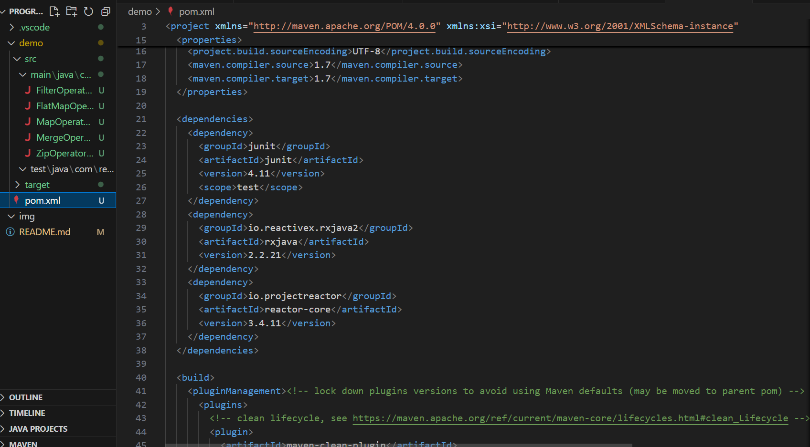

# ProgramacionReactiva
## 1. Adaptacion del entorno:

Añadimos las dependencias de RxJava y reactor.

## 2.1 Operador RxJava:

Observamos los operadores map, filter, flatMap, merge, zip con RxJava.

### Map:

### Filter:

### Flat:

### Merge:

### Zip:

## 2.2 Operador Reactor:

Observamos los operadores map, filter, flatMap, merge, zip con Reactor.

### Map:

### Filter:

### Flat:

### Merge:

### Zip:

## Contexto: 

Combinación de diferentes datos de distintas APIs en tiempo real enfocado al clima.

## Operadores usados:

1. `Mono.just` : Se usa para crear un Mono que emite un único objeto Weather.
2. `Flux.fromIterable` : Se usa para crear flujos (Flux) de noticias (News) y cotizaciones de criptomonedas (CryptoQuote).
3. `delayElement` : Introducen retrasos en las emisiones para simular latencia de APIs externas.
4. `flatMapMany` : Transforma un elemento de un Mono en un Flux, descomponiendo la estructura.
5. `filter` : Filtra las tuplas para incluir solo aquellas donde la categoría de la noticia sea "Technology".
6. `flatMap` : Introduce un procesamiento adicional simulado con un retraso en la emisión de cada mensaje y desempaca las listas de buffer para mantener un flujo continuo.
7. `switchIfEmpty` : Proporciona un Mono alternativo si el flujo original está vacío.
8. `concatWith` : Combina el flujo original con otro Publisher, emitiendo primero el original y luego el adicional.
9. `doOnNext` : Imprime cada mensaje emitido.
10. `onErrorResume` : Proporciona una ruta alternativa en caso de error, imprimiendo el error y continuando con un Mono.empty().

## Salida: 

